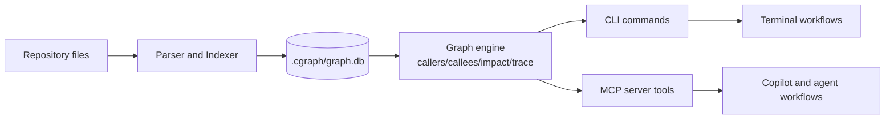
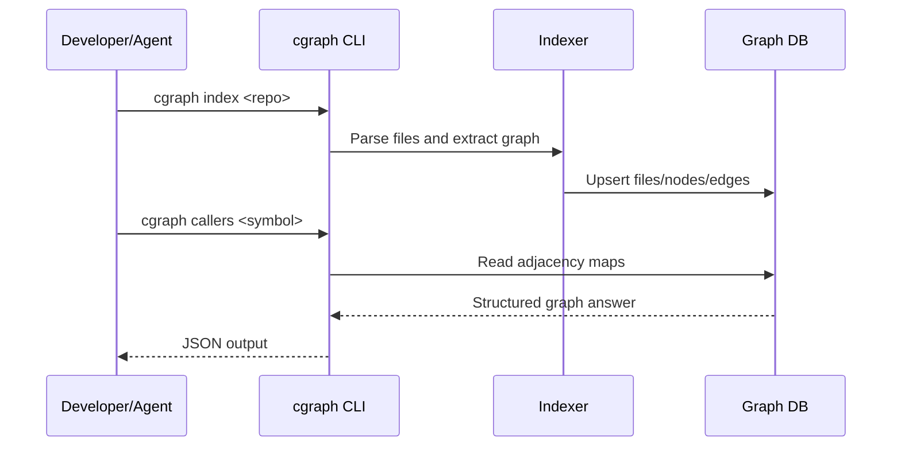
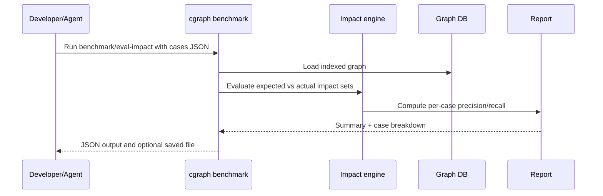
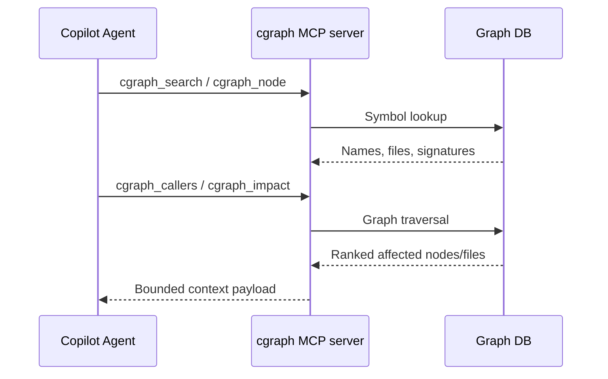

# cgraph

Graph-native code intelligence for AI agents and engineering teams.

cgraph turns codebases into a queryable graph so agents can answer structural questions in one step: callers, callees, impact, traces, changed symbols, affected tests, and architecture risk.

Instead of multi-step grep + file-hopping loops, cgraph provides bounded, high-signal responses optimized for speed and decision quality.

## Why teams adopt cgraph

cgraph is built around measurable outcomes:

- Faster time-to-answer for architecture and change-risk questions.
- Lower token/tool overhead by replacing search chains with graph queries.
- Better confidence via evidence-backed impact output and evaluation summaries.
- Practical production workflow: smoke checks, benchmark harness, and incremental indexing.

## What cgraph does

- Indexes repositories into a local graph database in `.cgraph/graph.db`.
- Extracts symbols and relationships across multiple languages.
- Exposes 23 MCP tools for agent workflows.
- Provides a CLI for direct usage in terminals and CI.
- Supports impact evaluation suites with precision/recall summaries.

## Supported languages

- TypeScript / JavaScript
- Python
- C / C++
- Shell / PowerShell

## Quick start

### Install

Windows:

```powershell
powershell -ExecutionPolicy Bypass -File install.ps1
```

macOS / Linux:

```bash
bash install.sh
```

From source:

```bash
git clone https://github.com/samarth-w/agent_graph.git
cd agent_graph
npm install
npm run build
npm link
```

### First run

```bash
cgraph index .
cgraph status . --pretty
```

## High-value workflows

### 1) Smoke check core capabilities

Confirms search, context, impact, and stats in one command.

```bash
cgraph smoke --dir demo/finance --target createUser --pretty
```

### 2) Run impact benchmark on demand

Uses a JSON case file and returns case-level plus aggregate metrics.

```bash
cgraph benchmark demo/impact-eval-cases.sample.json --dir demo/finance --pretty
```

Alias supported:

```bash
cgraph eval-impact demo/impact-eval-cases.sample.json --dir demo/finance --pretty
```

Save results to disk:

```bash
cgraph benchmark demo/impact-eval-cases.sample.json --dir demo/finance --save reports/impact-summary.json --pretty
```

### 3) Typical engineering questions

```bash
cgraph search "handleRequest" --pretty
cgraph callers "handleRequest" --pretty
cgraph callees "handleRequest" --pretty
cgraph trace "router" "dbWrite" --pretty
cgraph impact "createUser" --mode decision --pretty
cgraph affected "src/services/user.ts" --pretty
cgraph changed --pretty
```

## CLI commands that matter most

Core:

- `index [dir]` / `sync [dir]`
- `search <query>`
- `node <symbol>`
- `callers <symbol>`
- `callees <symbol>`
- `trace <from> <to>`
- `impact <symbol>`
- `context <task>`
- `explore <query>`

Quality and architecture:

- `deadcode`
- `cycles`
- `stats`
- `suggest`
- `lint`
- `validate`
- `dna`

Reliability and benchmarking:

- `smoke`
- `benchmark` (alias: `eval-impact`)

Infrastructure:

- `status`
- `files`
- `changed`
- `affected`
- `export`
- `watch [dir]`
- `serve --mcp`

## MCP toolset (23 tools)

Discovery and lookup:

- `cgraph_search`, `cgraph_node`, `cgraph_files`, `cgraph_status`

Traversal and impact:

- `cgraph_callers`, `cgraph_callees`, `cgraph_trace`, `cgraph_impact`, `cgraph_affected`, `cgraph_changed`

Context and coding support:

- `cgraph_context`, `cgraph_explore`, `cgraph_auto_context`, `cgraph_intent_search`

Architecture and quality:

- `cgraph_deadcode`, `cgraph_cycles`, `cgraph_stats`, `cgraph_suggest`, `cgraph_validate_plan`, `cgraph_lint`, `cgraph_dna`

Utilities:

- `cgraph_export`, `cgraph_retrieve_ccr`

## Performance and outcome snapshot

Recent workspace benchmark summary (from project scripts):

- 145 calls and 291.5s without graph-native routing
- 6 calls and 13.6s with cgraph
- Approximate speedup: 21.4x

Operational characteristics:

- Low-latency query path via in-memory adjacency maps
- Incremental indexing for changed files
- Local-first architecture (no mandatory cloud dependency)

## Architecture at a glance

```text
Codebase -> Parser/Indexer -> SQLite graph (.cgraph/graph.db)
                                   |
                             CLI + MCP server
                                   |
                      Agent/tool calls with bounded JSON
```

Key implementation areas:

- `src/indexer.ts` for indexing and change detection
- `src/graph.ts` for traversal, impact, analysis, suggestions
- `src/cli.ts` for command workflows and benchmark/smoke flows
- `src/mcp.ts` for MCP server tool surface
- `src/storage.ts` for graph persistence and bulk map access

## Development

Run locally:

```bash
npm install
npm run build
npm test
```

Focused checks:

```bash
npm test -- __tests__/cli.test.ts __tests__/graph.test.ts
node ./bin/cgraph.js smoke --dir demo/finance --target createUser --pretty
node ./bin/cgraph.js benchmark demo/impact-eval-cases.sample.json --dir demo/finance --pretty
```

## Configuration

Optional `.cgraph.json` in project root:

```json
{
  "maxDepth": 5,
  "maxNodes": 100,
  "ignorePaths": ["vendor", "generated"],
  "extensions": [".ts", ".tsx", ".py"]
}
```

## Usage as a library

```ts
import { GraphDB } from './src/storage';
import { analyzeImpact } from './src/graph';

const db = await GraphDB.open('.cgraph/graph.db');
const result = analyzeImpact(db, 'createUser', { mode: 'decision', maxDepth: 3, maxNodes: 50, rootDir: process.cwd() });
console.log(result);
db.close();
```

## Architecture deep dive



Core layers:

- Ingestion layer: file walking, language parsing, symbol and edge extraction.
- Storage layer: local SQLite graph with nodes, edges, and file metadata.
- Analysis layer: traversal, impact heuristics, trace, dead code, cycles, and stats.
- Interface layer: CLI commands and MCP tools for agent orchestration.

## End-to-end flows

### Flow 1: Index and query



### Flow 2: Change-risk evaluation



### Flow 3: Agent runtime with MCP



Operational notes:

- Smoke flow validates search, context, impact, and stats quickly in one command.
- Benchmark flow validates impact quality on curated cases without forcing PR checks.
- Incremental sync flow keeps graph freshness with reduced indexing cost.

## License

AGPL-3.0. See `LICENSE`.
