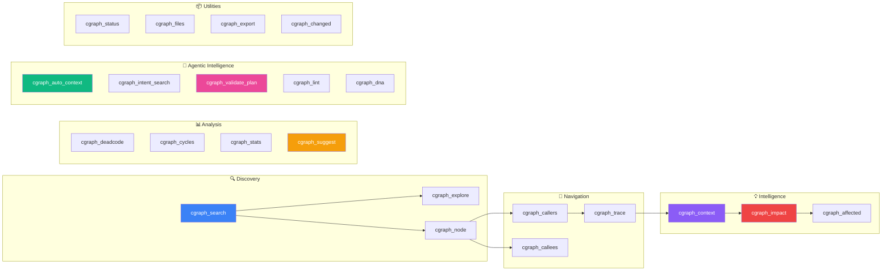
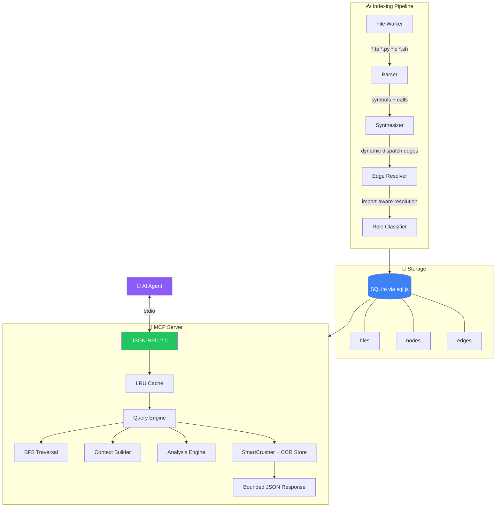

<div align="center">

# ⚡ cgraph

### Turn code intelligence into faster delivery and lower engineering cost.

**cgraph gives AI agents immediate structural context (callers, callees, impact, traces) so teams ship faster, cut investigation time, and reduce context-window waste.**

> **Novelty:** cgraph is a graph-native agent runtime that combines automatic tool routing with compression-aware context delivery, turning AI coding from multi-step file hunting into measurable, low-latency decision support.

[](https://nodejs.org)
[](https://www.typescriptlang.org)
[](https://modelcontextprotocol.io)
[](https://vitest.dev)
[](LICENSE)

```
  ┌─────────┐     MCP      ┌──────────┐    SQLite    ┌──────────┐
  │ Copilot │◄────────────►│  cgraph  │◄────────────►│ .cgraph/ │
  │  Agent  │  JSON-RPC    │  Server  │   sql.js     │ graph.db │
  └─────────┘              └──────────┘              └──────────┘
       │                        ▲                         ▲
      │ "who calls             │ 23 tools                │ files, nodes,
       │  handleRequest?"       │ instant response        │ edges, roles
       ▼                        │                         │
  ┌─────────┐              ┌──────────┐              ┌──────────┐
  │  1 call │  instead of  │  Parser  │───index────►│ Your Code│
  │  2.2s   │              │ + Walker │              │  .ts .py │
  └─────────┘              └──────────┘              │  .c  .sh │
                                                     └──────────┘
```

[Getting Started](#-getting-started) · [MCP Tools](#-mcp-tools) · [CLI Reference](#-cli-reference) · [Benchmarks](#-benchmarks) · [Architecture](#-architecture)

</div>

---

## 🎯 The Problem

Without a precomputed graph, AI-assisted workflows spend most of their time on low-value repository traversal.

That means:
- Slower code reviews and refactors
- More token spend for less signal
- Longer lead time from question to decision

Typical pattern:

```
❌ Without cgraph                          ✅ With cgraph
─────────────────────────────              ──────────────────────
1. grep "handleRequest"                    1. cgraph_node handleRequest
2. read_file server.ts                        → definition, callers,
3. grep "import.*handleRequest"               callees, file:line
4. read_file routes.ts                        all in ONE response
5. grep "routes" to find callers
6. read_file app.ts
7. finally has the answer                  Done. 2.2 seconds.
   14 seconds later...
```

**cgraph pre-computes the graph once**, then answers structural questions in one call with bounded, high-signal output.

---

## ✨ Feature Highlights

<table>
<tr>
<td width="50%">

### 🔌 Install & Forget
One-command installer. Auto-indexes on first Copilot query. No config per project.

### 🛠️ 23 MCP Tools
search · context · trace · explore · node · callers · callees · impact · retrieve-ccr · files · status · affected · export · changed · deadcode · cycles · stats · suggest · auto-context · intent-search · validate-plan · lint · dna

### ⚡ Dramatically Faster Workflows
Collapses multi-step grep→read chains into single precomputed graph queries. Avg MCP tool latency: **20ms**.

</td>
<td width="50%">

### 🌍 Multi-Language
TypeScript · JavaScript · Python · C · C++ · Shell · PowerShell — all from one index.

### 🧠 Smart Analysis
Dead code detection · cycle finding · refactoring suggestions · role classification · project statistics.

### 🔄 Incremental & Live
3-tier change detection. File watcher with auto re-index. Parallel parsing with worker threads.

</td>
</tr>
</table>

---

## 🚀 Getting Started

### Option A: One-Command Install

> No Node.js or git required — the installer handles everything.

<table>
<tr>
<td>

**Windows**
```powershell
powershell -ExecutionPolicy Bypass -File install.ps1
```

</td>
<td>

**macOS / Linux**
```bash
bash install.sh
```

</td>
</tr>
</table>

The installer will:
1. 📦 Download portable Node.js (if needed)
2. 📥 Fetch cgraph source
3. 🔨 Build it
4. 🔗 Add `cgraph` to your PATH
5. ⚙️ Configure VS Code MCP globally (works in **all** workspaces)

> **That's it.** Open any project → ask Copilot → cgraph auto-indexes and responds.

### Option B: From Source

```bash
git clone https://github.com/samarth-w/agent_graph.git
cd agent_graph
npm install && npm run build
npm link                       # optional: makes `cgraph` available globally
```

### Option C: One-Step Agent Enable (Workspace)

If you already cloned this repo and want MCP + dropdown agent mode configured automatically:

```powershell
powershell -ExecutionPolicy Bypass -File .\scripts\setup-agent.ps1 -ProjectPath .
```

This script:
- installs/builds cgraph,
- writes `.vscode/mcp.json`,
- enables workspace Copilot agent settings,
- validates `.github/agents/cgraph-auto.agent.md` for dropdown use.

<details>
<summary><strong>📋 VS Code MCP Configuration</strong> (if you installed from source)</summary>

Add to your VS Code `settings.json` (Ctrl+Shift+P → "Open User Settings (JSON)"):

```json
{
  "mcp": {
    "servers": {
      "cgraph": {
        "command": "node",
        "args": ["<path-to-cgraph>/bin/cgraph.js", "serve", "--mcp"],
        "cwd": "${workspaceFolder}"
      }
    }
  }
}
```

> **Windows tip:** If VS Code can't find `node`, use `"C:\\Program Files\\nodejs\\node.exe"`.

</details>

<details>
<summary><strong>👥 Teammate Setup</strong></summary>

**With Node.js:** `git clone` → `npm install` → `npm run build` → `npm link` → add MCP config.

**Without Node.js:** Share the repo folder → run `install.ps1` (Win) or `install.sh` (Mac/Linux) → done.

</details>

### 🤖 Copilot Agent Dropdown (cgraph auto)

This repo includes a custom Copilot agent profile at `.github/agents/cgraph-auto.agent.md`.

In Copilot Chat:
1. Open the agent/mode dropdown.
2. Select **cgraph auto**.
3. Ask normal coding questions — the agent auto-routes requests by tier:
  - Tier 1: fast lookup (`cgraph_search`, `cgraph_node`)
  - Tier 2: graph traversal (`cgraph_callers`, `cgraph_callees`, `cgraph_impact`, `cgraph_trace`)
  - Tier 3: edit/write/review (`cgraph_context`, `cgraph_affected`)

If cgraph has no match, it falls back to search + read automatically.

---

## 🔧 MCP Tools

When running as an MCP server, **23 tools** are available to AI agents:



| Tool | What it does | When to use |
|:-----|:-------------|:------------|
| `cgraph_context` | Builds ranked code context for a task | **Start here** — best for architecture & feature questions |
| `cgraph_search` | Find symbols by name with fuzzy matching | Looking for a specific function or class |
| `cgraph_node` | Symbol detail + full call trail | Deep-dive on one symbol |
| `cgraph_explore` | Source code for multiple related symbols | Need actual code, not just structure |
| `cgraph_callers` | Who calls this? (reverse graph) | Understanding usage patterns |
| `cgraph_callees` | What does this call? (forward graph) | Understanding dependencies |
| `cgraph_trace` | Call path between two symbols | "How does X reach Y?" |
| `cgraph_impact` | Blast radius of a change | Pre-change risk assessment |
| `cgraph_retrieve_ccr` | Retrieve full payload for a compressed CCR response | After truncated/compressed outputs when you need original full data |
| `cgraph_affected` | Test files impacted by changes | CI optimization, test selection |
| `cgraph_changed` | Symbols changed in git diff | Code review, change mapping |
| `cgraph_deadcode` | Unreachable symbols | Cleanup candidates |
| `cgraph_cycles` | Circular dependency detection | Architecture health |
| `cgraph_stats` | Project metrics & hotspots | Codebase overview |
| `cgraph_suggest` | Refactoring suggestions | Extract, inline, move, split recommendations |
| `cgraph_export` | Mermaid / DOT / HTML diagrams | Visualization & docs |
| `cgraph_files` | List all indexed files | Inventory check |
| `cgraph_auto_context` | File-level warm start: symbols, callers, callees, tests | **Open a file** — instant awareness before coding |
| `cgraph_intent_search` | Natural language symbol search (BM25) | "find auth middleware" — searches by meaning, not just name |
| `cgraph_validate_plan` | Pre-flight change risk assessment | Before refactoring — blast radius, affected tests, risk score |
| `cgraph_lint` | Architecture rule enforcement | CI gate — deny imports, max fan-out, cycle checks |
| `cgraph_dna` | Codebase fingerprint & health scores | Onboarding — languages, architecture style, health overview |
| `cgraph_status` | Index health & stats | Debugging, verification |

---

## 💻 CLI Reference

```
cgraph <command> [options]
```

### Core Commands

| Command | Description |
|:--------|:------------|
| `index [dir]` | Build / update the code graph (incremental) |
| `sync [dir]` | Re-index changed files only |
| `search <query>` | Search symbols — supports `kind:`, `lang:`, `path:`, `role:`, `exported:` filters |
| `callers <symbol>` | Reverse call graph — who calls this? |
| `callees <symbol>` | Forward call graph — what does this call? |
| `impact <symbol>` | What breaks if this changes? |
| `trace <from> <to>` | Find the call path between two symbols |
| `context <task>` | Build ranked code context for a task description |
| `explore <query>` | Get source code for related symbols |
| `node <symbol>` | Symbol detail with call trail |
| `query <symbol>` | Look up a symbol with callers/callees |
| `where <symbol>` | Find where a symbol is defined |

### Analysis Commands

| Command | Description |
|:--------|:------------|
| `deadcode` | Find unreachable symbols (dead code) |
| `cycles` | Detect circular dependencies |
| `stats` | Project metrics — hotspots, coupling, complexity |
| `suggest` | AI-powered refactoring suggestions |

### Agentic Intelligence Commands

| Command | Description |
|:--------|:------------|
| `auto-context <file>` | File-level warm start — symbols, callers, callees, related tests |
| `intent <query>` | Natural language symbol search (BM25 scoring) |
| `validate` | Pre-flight change risk assessment from stdin |
| `lint` | Architecture rule enforcement via `.cgraph.json` rules |
| `dna` | Codebase fingerprint — languages, health scores, architecture style |

### Infrastructure Commands

| Command | Description |
|:--------|:------------|
| `status` | Index health (files, nodes, edges, languages, roles) |
| `files` | List all indexed files |
| `affected <files>` | Find test files impacted by changes |
| `export` | Generate Mermaid, DOT, or interactive HTML diagrams |
| `changed` | Map git diff to changed symbols |
| `watch [dir]` | Watch for file changes and auto re-index |
| `serve --mcp` | Start MCP server (JSON-RPC 2.0 over stdio) |

### Global Options

```
--depth <n>       Max traversal depth (default: 3)
--max-nodes <n>   Max nodes to return (default: 50)
--kind <kind>     Filter by symbol kind (function, class, method, etc.)
--file <path>     Filter by file path
--json            Raw JSON output
--pretty          Formatted output
```

### Project Configuration

Drop a `.cgraph.json` in your project root to customize behavior:

```json
{
  "maxDepth": 5,
  "maxNodes": 100,
  "ignorePaths": ["vendor", "generated"],
  "extensions": [".ts", ".tsx", ".py"]
}
```

---

## 📊 Benchmarks

> Fresh run on cgraph workspace (`node scripts/benchmark-agent.mjs .` + `node scripts/benchmark.mjs .`)
> Workspace size during run: 104 files, 848 nodes, 1634 edges.

<table>
<tr>
<th align="left">Agent Question</th>
<th align="center">Without cgraph</th>
<th align="center">With cgraph</th>
<th align="center">Speedup</th>
</tr>
<tr>
<td>Where is <code>set</code> defined and who calls it?</td>
<td align="center">89 calls · 178.0s</td>
<td align="center"><strong>1 call · 2.3s</strong></td>
<td align="center">🟢 <strong>78.8x</strong></td>
</tr>
<tr>
<td>Impact of changing <code>AxiosHeaders</code>?</td>
<td align="center">34 calls · 69.4s</td>
<td align="center"><strong>1 call · 2.3s</strong></td>
<td align="center">🟢 <strong>30.7x</strong></td>
</tr>
<tr>
<td>How does <code>handle</code> reach <code>set</code>?</td>
<td align="center">6 calls · 12.0s</td>
<td align="center"><strong>1 call · 2.3s</strong></td>
<td align="center">🟢 <strong>5.3x</strong></td>
</tr>
<tr>
<td>Changed <code>docs/scripts/utils.js</code> — what tests to run?</td>
<td align="center">5 calls · 10.1s</td>
<td align="center"><strong>1 call · 2.3s</strong></td>
<td align="center">🟢 <strong>4.5x</strong></td>
</tr>
<tr>
<td>Explain the architecture</td>
<td align="center">11 calls · 22.0s</td>
<td align="center"><strong>2 calls · 4.6s</strong></td>
<td align="center">🟢 <strong>4.8x</strong></td>
</tr>
<tr>
<td><strong>Total</strong></td>
<td align="center"><strong>145 calls · 291.5s</strong></td>
<td align="center"><strong>6 calls · 13.6s</strong></td>
<td align="center">⚡ <strong>21.4x faster</strong></td>
</tr>
</table>

### MCP Tool Latency (self-hosted benchmark)

| Metric | Value |
|:-------|:------|
| Avg latency (tool suite) | **20ms** |
| Min latency | **2ms** (search, callees) |
| Max latency | **66ms** (explore — includes source read) |
| Cold index | **803ms** (from scratch) |
| Warm re-sync | **406ms** (no-change check) |
| Cold start + query | **204ms** (fire-and-forget) |
| Burst (10× search) | **6ms/call** |

> Performance powered by bulk adjacency maps — `getFileMap`, `getNodeMap`, `getAdjacencyMaps` load the graph in 3 queries, then all lookups are O(1) map gets. Zero N+1 query patterns.

<details>
<summary><strong>🏃 Run benchmarks yourself</strong></summary>

```bash
# Agent workflow comparison (with vs without cgraph)
node scripts/benchmark-agent.mjs <your-project-dir>

# MCP server latency benchmark (burst, cold start)
node scripts/benchmark.mjs

# Raw efficiency comparison (grep+read vs cgraph)
node scripts/benchmark-compare.mjs
```

</details>

---

## 🏗️ Architecture

### How It Works



### Design Principles

| Principle | Implementation |
|:----------|:---------------|
| **Zero cloud dependencies** | Pure JS/WASM — `sql.js` instead of `better-sqlite3`, no native bindings |
| **Incremental by default** | 3-tier: mtime+size → content hash → parse. Rebuilds only what changed |
| **Import-aware resolution** | Resolves calls through imports: import match > same-file > global name |
| **Smart role classification** | Symbols tagged as `entry` · `core` · `hub` · `bridge` · `utility` · `leaf` · `test` · `dead` |
| **Bounded traversal** | BFS with `maxDepth` + `maxNodes` caps + cycle detection |
| **Token-conscious** | Context payloads include estimated token counts so agents can budget |
| **Adaptive compression** | SmartCrusher compacts oversized payloads and stores lossless CCR snapshots retrievable via `cgraph_retrieve_ccr` |
| **Bulk query optimization** | Adjacency maps loaded in 3 SQL queries — all per-node lookups are O(1) map gets |

### Supported Languages

<table>
<tr>
<td align="center">
<strong>JavaScript</strong><br/>
<code>.js</code> <code>.jsx</code> <code>.mjs</code> <code>.cjs</code><br/>
<sub>via @babel/parser</sub>
</td>
<td align="center">
<strong>TypeScript</strong><br/>
<code>.ts</code> <code>.tsx</code><br/>
<sub>via @babel/parser</sub>
</td>
<td align="center">
<strong>Python</strong><br/>
<code>.py</code> <code>.pyi</code><br/>
<sub>regex-based</sub>
</td>
</tr>
<tr>
<td align="center">
<strong>C / C++</strong><br/>
<code>.c</code> <code>.h</code> <code>.cpp</code> <code>.cc</code> <code>.hpp</code><br/>
<sub>regex-based · #include resolution</sub>
</td>
<td align="center">
<strong>Shell</strong><br/>
<code>.sh</code> <code>.bash</code> <code>.zsh</code><br/>
<sub>regex-based · source/. imports</sub>
</td>
<td align="center">
<strong>PowerShell</strong><br/>
<code>.ps1</code> <code>.psm1</code> <code>.psd1</code><br/>
<sub>regex-based · dot-sourcing</sub>
</td>
</tr>
</table>

### Framework Detection

Route and endpoint extraction for: **Express** · **React Router** · **Next.js** · **Flask** · **FastAPI** · **Django**

### Database Schema

Per-project SQLite at `.cgraph/graph.db`:

```
┌──────────┐     ┌──────────────────────────────────────────────┐     ┌───────────┐
│  files   │     │                   nodes                     │     │   edges   │
├──────────┤     ├──────────────────────────────────────────────┤     ├───────────┤
│ id       │◄───┐│ id · file_id · name · qualified_name        │┌───►│ source_id │
│ path     │    ││ kind · start_line · end_line · signature    ││    │ target_id │
│ hash     │    └┤ doc · exported · role                       ├┘    │ kind      │
│ language │     └──────────────────────────────────────────────┘     └───────────┘
│ mtime    │                        ▲
│ size     │     ┌──────────┐       │         ┌──────────┐
└──────────┘     │ raw_refs │───────┘         │ metadata │
                 │ caller   │                 │ key      │
                 │ callee   │                 │ value    │
                 │ kind     │                 └──────────┘
                 └──────────┘
```

---

## 📁 Project Structure

```
cgraph/
├── bin/cgraph.js                  # CLI entry point
├── src/
│   ├── cli.ts                     # 28 CLI commands (commander)
│   ├── config.ts                  # Configuration + .cgraph.json loader
│   ├── context.ts                 # Context builder (search → expand → snippets)
│   ├── graph.ts                   # BFS traversal, impact, trace, dead code, cycles, suggest
│   ├── indexer.ts                 # File walker + parallel parser + incremental edge resolver
│   ├── mcp.ts                     # MCP server (23 tools, JSON-RPC 2.0, progress notifications)
│   ├── storage.ts                 # GraphDB (sql.js WASM SQLite)
│   ├── parser.ts                  # Multi-language parser (babel + regex)
│   ├── synthesizer.ts             # Dynamic dispatch edge synthesis
│   ├── frameworks.ts              # Framework route extraction
│   ├── lint.ts                    # Architecture rule enforcement engine
│   ├── search.ts                  # Fuzzy symbol search + BM25 intent search
│   ├── export.ts                  # Mermaid / DOT / HTML diagram generation
│   ├── cache.ts                   # LRU cache with disk persistence
│   ├── watcher.ts                 # File watcher with debounced re-index
│   ├── git.ts                     # Git diff → changed symbol mapping
│   ├── adaptive.ts                # Dynamic traversal limits
│   ├── query-parser.ts            # Search query field extraction
│   ├── gitignore.ts               # .gitignore parsing
│   └── types.ts                   # All type definitions
├── __tests__/                     # 427 tests (vitest)
├── scripts/                       # Benchmarks, installers, smoke tests
├── demo/                          # Finance tracker + C++/Shell demos
├── install.ps1 / install.sh       # Standalone installers
└── .cgraph.json                   # Project-level configuration
```

---

## 🧪 Development

```bash
npm run build              # compile TypeScript
npm run dev                # watch mode (rebuild on save)
npm test                   # run 427 unit tests
npm run test:watch         # watch tests
```

<details>
<summary><strong>📜 All scripts</strong></summary>

| Script | Purpose |
|:-------|:--------|
| `install.ps1` / `install.sh` | Standalone installer (downloads Node if needed) |
| `scripts/local-install.ps1` / `.sh` | Build + npm link for dev testing |
| `scripts/smoke-test.ps1` / `.sh` | End-to-end CLI smoke tests |
| `scripts/setup-mcp.ps1` | Auto-configure MCP for a project |
| `scripts/setup-agent.ps1` | End-to-end workspace bootstrap: build + MCP + Copilot agent settings + dropdown agent validation |
| `scripts/benchmark.mjs` | MCP server latency benchmark (burst, cold start) |
| `scripts/benchmark-agent.mjs` | Agent workflow benchmark — with vs without cgraph |
| `scripts/benchmark-compare.mjs` | Raw efficiency comparison (grep+read vs cgraph) |

</details>

---

## 📚 Usage as Library

```typescript
import { GraphDB } from 'cgraph/storage';
import { indexProject } from 'cgraph/indexer';
import { findCallers, suggestRefactorings } from 'cgraph/graph';
import { buildContext } from 'cgraph/context';

// Index & query
const db = await GraphDB.open('.cgraph/graph.db');
await indexProject('.');

const callers = findCallers(db, 'handleRequest', { maxDepth: 3 });
const suggestions = suggestRefactorings(db, { file: 'src/app.ts' });

db.close();
```

---

<div align="center">

## 📄 License

**AGPL-3.0** — see [LICENSE](LICENSE) for details.

For proprietary/closed-source usage, contact the author for a commercial license.

---

<sub>Built with ❤️ for developers who want their AI agents to actually understand their code.</sub>

</div>
