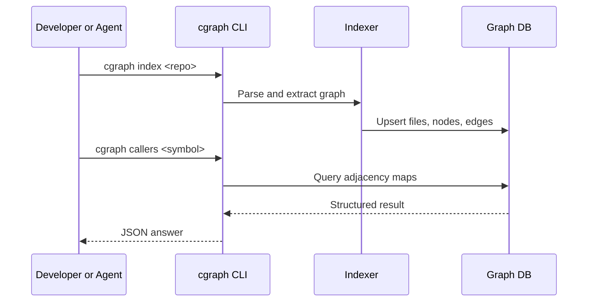
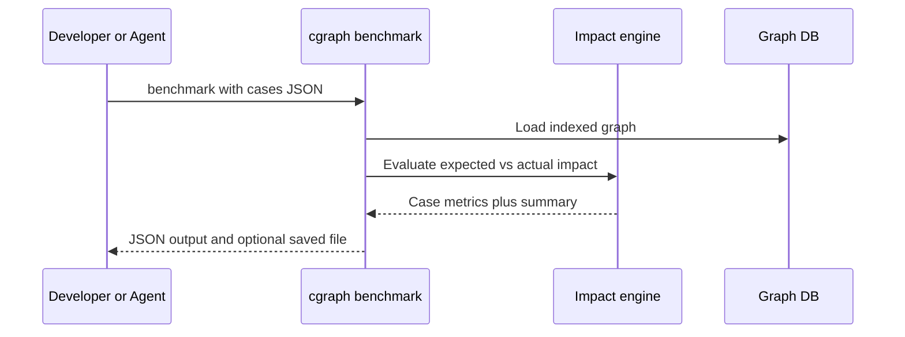
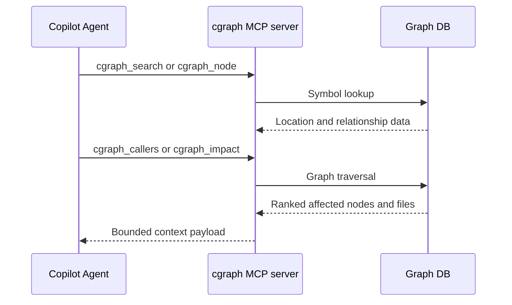

<div align="center">

# cgraph

### Code intelligence that feels instant.

Turn any codebase into a queryable graph so developers and AI agents can move from question to decision in one step.

[Why it wins](#why-cgraph-wins) · [Quick start](#quick-start) · [Core workflows](#core-workflows) · [Architecture](#architecture) · [CLI and MCP](#cli-and-mcp)

</div>

---

## The one-line pitch

cgraph precomputes repository structure and relationships so you can answer high-value engineering questions without grep chains, file hopping, or context sprawl.

## Why cgraph wins

### Faster decisions

- Ask once, get callers, callees, impact, trace, changed symbols, affected tests, and PR-ready risk summaries.
- Replace multi-step investigation loops with single graph-native queries.

### Better confidence

- Impact output includes evidence-aware reasoning.
- Optional benchmark suites report precision and recall for impact quality.

### Built for real workflows

- Local-first architecture with low-latency responses.
- Incremental indexing and watch mode for day-to-day development.
- CLI plus MCP tools for terminal, CI, and agent runtime usage.

## Quick start

### Install

Windows:

```powershell
powershell -ExecutionPolicy Bypass -File install.ps1
```

macOS / Linux:

```bash
bash install.sh
```

From source:

```bash
git clone https://github.com/samarth-w/agent_graph.git
cd agent_graph
npm install
npm run build
npm link
```

### First 3 commands

```bash
cgraph index .
cgraph status . --pretty
cgraph smoke --dir demo/finance --target createUser --pretty
```

## Core workflows

### 1. Validate the stack in one shot

Smoke checks verify search, context, impact, and stats in one command.

```bash
cgraph smoke --dir demo/finance --target createUser --pretty
```

### 2. Benchmark impact quality on demand

Run curated impact cases without forcing checks on every PR.

```bash
cgraph benchmark demo/impact-eval-cases.sample.json --dir demo/finance --pretty
```

Alias:

```bash
cgraph eval-impact demo/impact-eval-cases.sample.json --dir demo/finance --pretty
```

Save a report artifact:

```bash
cgraph benchmark demo/impact-eval-cases.sample.json --dir demo/finance --save reports/impact-summary.json --pretty
```

### 3. Solve common engineering questions fast

```bash
cgraph search "handleRequest" --pretty
cgraph callers "handleRequest" --pretty
cgraph callees "handleRequest" --pretty
cgraph trace "router" "dbWrite" --pretty
cgraph impact "createUser" --mode decision --pretty
cgraph affected "src/services/user.ts" --pretty
cgraph changed --pretty
cgraph overview . --pretty
```

### 4. Build a PR decision summary in one command

```bash
cgraph pr-summary --dir . --pretty
cgraph pr-summary --dir . --files src/cli.ts,src/mcp.ts --format markdown
```

### 5. Enforce merge gates with policy thresholds

```bash
cgraph gate --dir . --pretty
cgraph gate --dir . --files src/cli.ts --max-cycles 2 --max-dead 50 --min-health 70 --max-risk 60
```

### 6. Track quality trend over time

```bash
cgraph baseline save sprint-24 --dir .
cgraph baseline list --dir .
cgraph trend --dir .
```

## Performance snapshot

Recent benchmark summary in this workspace:

- Without graph-native flow: 145 calls, 291.5s
- With cgraph: 6 calls, 13.6s
- Net speedup: about 21.4x

Why it stays fast:

- Precomputed symbol and relationship graph.
- Bulk adjacency maps instead of repeated scans.
- Incremental sync for lower update cost.

## Architecture

### At a glance

```text
Repository files -> Parser + Indexer -> .cgraph/graph.db
                                         |
                                  Graph engine
                           (search, trace, impact, stats)
                                         |
                                 CLI and MCP tools
```

### Layer model

- Ingestion layer: file walking, parsing, symbol and edge extraction.
- Storage layer: local SQLite graph with files, nodes, and edges.
- Analysis layer: traversal, impact heuristics, cycles, dead code, stats.
- Interface layer: CLI commands and MCP server tools.

### End-to-end flows

Flow 1: index and query



Flow 2: impact benchmark



Flow 3: agent runtime



## CLI and MCP

### Most-used CLI commands

Core:

- index [dir], sync [dir]
- search <query>, node <symbol>
- callers <symbol>, callees <symbol>
- trace <from> <to>, impact <symbol>
- context <task>, explore <query>

Quality and architecture:

- deadcode, cycles, stats, suggest
- lint, validate, dna, overview

PR and release quality:

- pr-summary, gate
- baseline save|list|compare, trend

Reliability and benchmark:

- smoke
- benchmark (alias: eval-impact)

Infra:

- status, files, changed, affected, export, watch [dir], serve --mcp

Output modes:

- `--pretty` for human-readable JSON
- `--format markdown` on overview/pr-summary/gate for PR-ready reports

### MCP tools (23)

- cgraph_search, cgraph_node, cgraph_files, cgraph_status
- cgraph_callers, cgraph_callees, cgraph_trace, cgraph_impact, cgraph_affected, cgraph_changed
- cgraph_context, cgraph_explore, cgraph_auto_context, cgraph_intent_search
- cgraph_deadcode, cgraph_cycles, cgraph_stats, cgraph_suggest, cgraph_validate_plan, cgraph_lint, cgraph_dna
- cgraph_export, cgraph_retrieve_ccr

## Diagnostics and examples

Inspect the local graph and repair orphan edges with the library helpers:

```ts
import { GraphDB, inspectDbHealth, repairDbHealth } from 'cgraph';

const db = await GraphDB.open('./.cgraph/graph.db');
const report = inspectDbHealth(db, process.cwd());
if (!report.ok) {
  const repaired = repairDbHealth(db, process.cwd());
  console.log(`Repaired ${repaired.repaired_count} edge(s).`);
}
```

Reference material and examples:

- [docs/cli-usage.md](docs/cli-usage.md)
- [docs/mcp-workflows.md](docs/mcp-workflows.md)
- [docs/troubleshooting.md](docs/troubleshooting.md)
- [examples/diagnostics-repair.ts](examples/diagnostics-repair.ts)
- [fixtures/impact-eval-cases.sample.json](fixtures/impact-eval-cases.sample.json)
- [fixtures/performance-budget.json](fixtures/performance-budget.json)

## Development

Run locally:

```bash
npm install
npm run build
npm test
```

Focused verification:

```bash
npm test -- __tests__/cli.test.ts __tests__/graph.test.ts
node ./bin/cgraph.js smoke --dir demo/finance --target createUser --pretty
node ./bin/cgraph.js benchmark demo/impact-eval-cases.sample.json --dir demo/finance --pretty
```

## Configuration

Optional .cgraph.json in project root:

```json
{
  "maxDepth": 5,
  "maxNodes": 100,
  "ignorePaths": ["vendor", "generated"],
  "extensions": [".ts", ".tsx", ".py"],
  "gate": {
    "maxCycles": 2,
    "maxDeadSymbols": 50,
    "minOverallHealth": 70,
    "maxRiskScore": 60,
    "requireAffectedTests": false
  }
}
```

## Use as a library

```ts
import { GraphDB } from './src/storage';
import { analyzeImpact } from './src/graph';

const db = await GraphDB.open('.cgraph/graph.db');
const result = analyzeImpact(db, 'createUser', {
  mode: 'decision',
  maxDepth: 3,
  maxNodes: 50,
  rootDir: process.cwd(),
});
console.log(result);
db.close();
```

## License

AGPL-3.0. See LICENSE.
