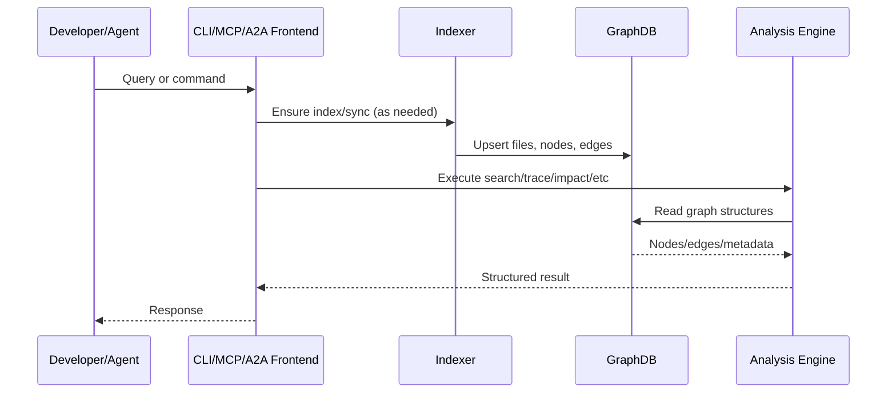
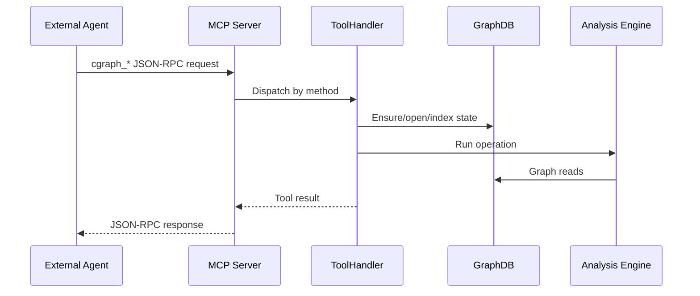
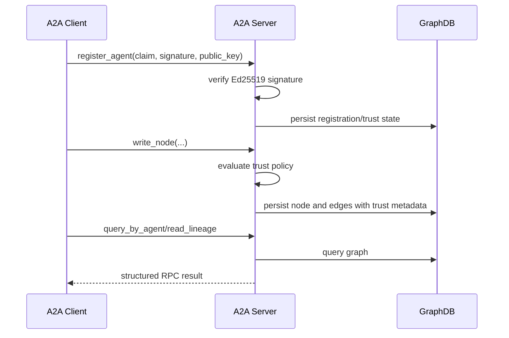

# cgraph Full Architecture

This document describes the full architecture of cgraph, including ingestion, storage, analysis, interfaces (CLI/MCP/A2A), performance model, and operational/quality systems.

## 1) Architecture at a Glance

```text
Repository Source
  -> Parser + Indexer (symbol/ref extraction)
  -> GraphDB (SQLite in .cgraph/graph.db)
  -> Analysis Engine (search/trace/impact/stats/quality)
  -> Interfaces: CLI | MCP | A2A HTTP JSON-RPC
  -> Automation: benchmarks, gates, CI workflows
```

Core design principles:

- Local-first graph persistence for low-latency queries.
- Precompute once, query many (avoid repeated source scans).
- Shared analysis core consumed by multiple interfaces.
- Deterministic outputs for CI and agent workflows.

## 2) Core Layers

### Ingestion Layer

Primary module: `src/indexer.ts`

Responsibilities:

- File discovery and ignore filtering.
- Parse phase execution (parallel worker support where possible).
- Symbol and raw reference extraction.
- Edge resolution and role classification.
- Incremental synchronization of graph state.

Key entrypoint:

- `indexProject(rootDir, options)`

### Parsing Layer

Primary module: `src/parser.ts` (+ language-specific helpers)

Responsibilities:

- Language-aware AST/syntax parsing.
- Normalize symbols and references into graph-friendly intermediate structures.
- Provide consistent output shape for downstream index storage.

### Storage Layer

Primary module: `src/storage.ts` (`GraphDB`)

Responsibilities:

- Database open/close, migrations, and metadata.
- File/node/edge CRUD.
- Raw reference staging and resolved edge access.
- Full-text and fuzzy symbol search helpers.
- Cached adjacency map generation for fast traversals.

Notable persistence features:

- SQLite-backed graph at `.cgraph/graph.db`.
- Migrations for evolving schema (including A2A cost fields).
- CCR persistence for compressed context payload retrieval.

### Analysis Layer

Primary modules: `src/graph.ts`, `src/search.ts`, `src/context.ts`, `src/graph/traversal.ts`, `src/lint.ts`

Responsibilities:

- Graph traversal (`callers`, `callees`, `trace`, `impact`).
- Symbol/file discovery (`search`, `node`, `files`, `status`).
- Risk and health (`deadcode`, `cycles`, `stats`, `suggest`, `validate`).
- Architecture policy linting and DNA summary.
- Context expansion and exploration for agent workflows.

## 3) Interface Layer

### CLI Interface

Primary module: `src/cli.ts`

Execution model:

1. Parse command and options.
2. Resolve root/config.
3. Open or build graph state.
4. Call analysis/storage/index modules.
5. Emit structured output (`--pretty` / markdown formatters where supported).

### MCP Interface

Primary module: `src/mcp.ts`

Execution model:

1. Start JSON-RPC loop via `startMcpServer`.
2. `ToolHandler` dispatch map routes `cgraph_*` tool methods.
3. Shared `getDb` path ensures graph availability/index freshness.
4. Handlers invoke core analysis functions.
5. Optional output compression and CCR retrieval for context-heavy responses.

### A2A Interface

Primary module: `src/a2a.ts`

Execution model:

1. HTTP server startup via `startA2AServer`.
2. Discovery endpoint: `/.well-known/agent-card.json`.
3. RPC endpoint routes to `handleA2ARpcRequest`.
4. Supported methods: `register_agent`, `write_node`, `query_by_agent`, `read_lineage`.

Trust model integration:

- Policy from `src/config.ts` (`registration_only`, verification latency/fallback knobs).
- Ed25519 claim verification for signed registration.
- Write trust state reflected in persisted node semantics.

## 4) Data Model (Conceptual)

Entities:

- Files: path + language + indexing metadata.
- Nodes: symbol records (name, kind, qualified name, doc, file binding).
- Edges: relationships (calls/imports/references), optional cost metadata.
- Raw refs: unresolved references used during resolution pass.
- Meta/config tables: status/version/index timestamps.
- CCR records: compressed response payloads retrievable by id.

Relationship model:

- Directed edges support impact and path traversal.
- Dual adjacency maps (`from`/`to`) optimize caller/callee and cycle analysis.

## 5) End-to-End Flows

### Index + Query Flow



### MCP Tool Flow



### A2A Trust Flow



## 6) Performance Architecture

Key performance strategies:

- Persistent local graph avoids repeated full-source scans.
- Cached adjacency/materialized maps reduce high-fanout query cost.
- Incremental indexing and watch mode limit recomputation scope.
- Adaptive limits (`src/adaptive.ts`) bound expensive traversals.
- Optional compressed output path for large context payloads.

Observed benchmark posture (current branch state):

- A2A multihop benchmark and enforce-mode gates are integrated.
- Strict and local gate profiles are both available.

## 7) Reliability and Quality Controls

Test layers:

- Unit and integration tests under `__tests__/`.
- Dedicated A2A protocol and benchmark tests.
- Storage and migration compatibility checks.

Quality gates:

- Benchmark budgets in `fixtures/`.
- CI workflow for A2A benchmark gate.
- Architecture and dead-code checks via CLI/MCP tools.

## 8) Security and Trust Considerations

- A2A registration supports signed identity claims (Ed25519).
- Trust mode governs verified vs unverified write semantics.
- Trust metadata is propagated through node/query responses.
- Policy is config-driven, allowing stricter production profiles.

## 9) Operational Model

Supported operating modes:

- Local developer CLI (`index`, `search`, `impact`, etc).
- Persistent MCP tool server for agent runtime.
- HTTP A2A adapter for interoperable multi-agent write/query flows.

Common lifecycle:

1. Build/index repository graph.
2. Serve via CLI or long-running MCP/A2A mode.
3. Run benchmark/gate checks before merge.

## 10) Architectural Changes Introduced by A2A Rollout

Compared with pre-A2A architecture, the rollout added:

- New interface layer module: `src/a2a.ts`.
- Trust-aware registration and write policy enforcement.
- Storage schema support for edge-cost metadata.
- A2A-specific benchmark harness + helper modules.
- Enforceable CI gate workflow for A2A quality/perf thresholds.

This expanded interoperability without replacing the core graph engine architecture.
